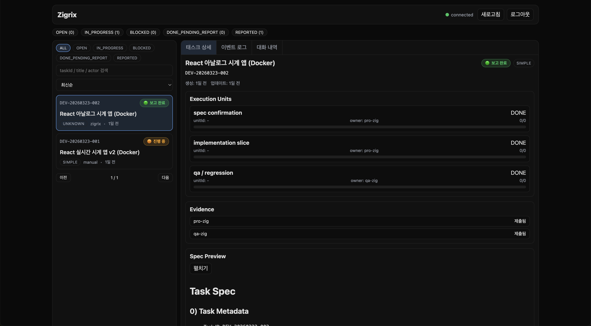
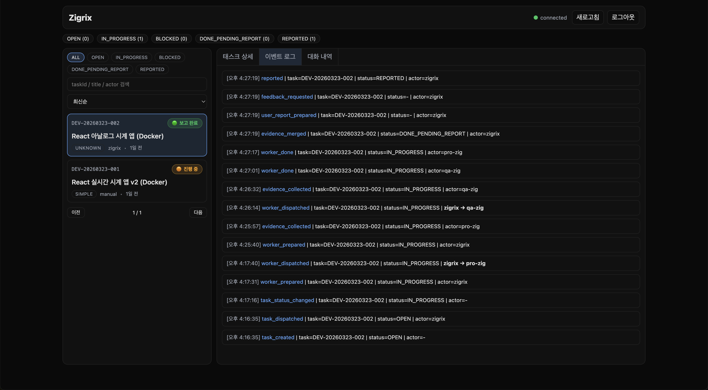
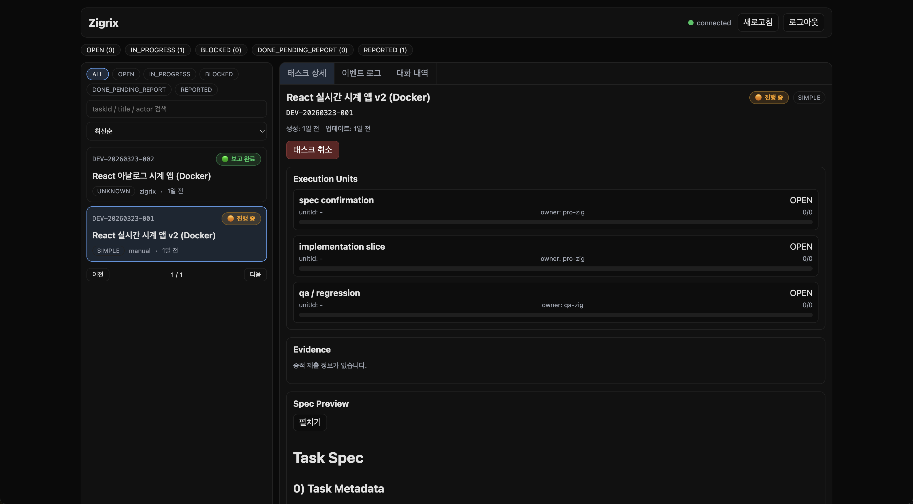
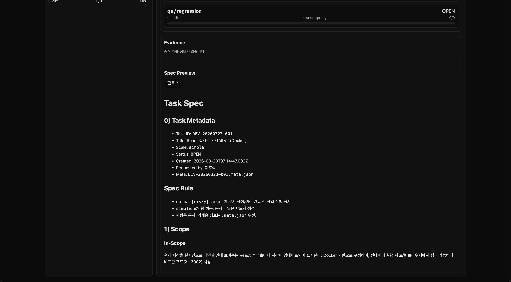

<h1 align="center">Zigrix</h1>

<p align="center">
  <strong>OpenClaw-first orchestration CLI for tracked, multi-agent execution.</strong>
</p>

<p align="center">
  Zigrix turns ad-hoc delegation into a visible workflow with specialist routing,
  evidence collection, and reportable finalization.
</p>

<p align="center">
  
  
  
</p>

<p align="center">
  <a href="#why-zigrix">Why Zigrix</a> ·
  <a href="#is-zigrix-for-you">Is Zigrix for you?</a> ·
  <a href="#quick-start">Quick Start</a> ·
  <a href="#core-workflow">Core Workflow</a> ·
  <a href="#openclaw-integration">OpenClaw Integration</a> ·
  <a href="#dashboard">Dashboard</a> ·
  <a href="#docs">Docs</a>
</p>

---

## Why Zigrix

Most agent-heavy workflows break down in the same places:

- work gets delegated, but not consistently tracked
- specialist routing depends on memory, not policy
- outputs arrive without structured evidence
- final reporting is manual and hard to audit

Zigrix gives that flow a control surface: dispatch, worker lifecycle, evidence, and finalization in one runtime.

---

## Is Zigrix for you?

Zigrix is a strong fit if you want:

- **one-time operator setup, then agent-driven execution**
- **repeatable orchestration rules** instead of ad-hoc delegation
- **recoverable local runtime state** for task progress and reports
- **OpenClaw compatibility** without requiring a plugin-based architecture

Zigrix may be a poor fit if your main goal is a hosted, multi-tenant control plane.

---

## Supported environments

- **Operating systems:** macOS, Linux
- **Runtime:** Node.js (current LTS recommended)
- **Package manager:** npm
- **OpenClaw:** optional, but recommended for full orchestration flow

Zigrix still works as a standalone CLI when OpenClaw is not installed.

---

## Quick Start

### 1) Install

```bash
npm install -g zigrix
```

From source:

```bash
./install.sh
```

### 2) Onboard

```bash
zigrix onboard
```

### 3) Verify

```bash
zigrix doctor
zigrix dashboard
```

That is the intended entry flow: **install → onboard → done**.

---

## Usage model: human vs agent

| Role | Primary responsibility |
|---|---|
| **Human operator** | Install Zigrix, run `zigrix onboard`, verify readiness (`zigrix doctor`), then step out of day-to-day orchestration |
| **OpenClaw / automation agents** | Run task/worker/evidence/report commands to execute and complete orchestration work |
| **Human (maintenance mode)** | Use `zigrix configure` or `zigrix reset` only when reconfiguration or recovery is needed |

This split keeps normal operation agent-driven while keeping setup and governance human-controlled.

---

## Core Workflow

Typical operational flow:

```text
Human setup
  install -> zigrix onboard -> doctor check

Agent execution
  zigrix task dispatch
    -> worker prepare/register/complete
    -> evidence collect/merge
    -> task finalize + report
```

Common commands:

```bash
# Dispatch orchestration work
zigrix task dispatch --title "Implement auth module" --description "..." --scale normal --json

# Check runtime health
zigrix doctor

# Launch dashboard
zigrix dashboard --port 3838

# Maintenance surfaces
zigrix configure --section agents
zigrix configure --section skills
zigrix reset state --yes
```

---

## What onboard does

`zigrix onboard` prepares runtime and integration in one pass:

1. creates runtime directories from `zigrix.config.json` (`paths.*`) and default config/state structure
2. seeds rule files from bundled templates
3. ensures `zigrix` is reachable from the runtime-visible PATH
4. detects OpenClaw and imports agents from `openclaw.json`
5. registers bundled `skills/zigrix-*` into `~/.openclaw/skills/`
6. leaves the environment ready for agent-led orchestration

---

## OpenClaw Integration

When OpenClaw is present, Zigrix is optimized for this model:

- import agent definitions and normalize roles
- establish orchestrator ownership for task execution
- register Zigrix skill packs for agent readiness checks
- keep CLI reachability stable for OpenClaw runtime

Read the full integration contract in [docs/openclaw-integration.md](docs/openclaw-integration.md).

---

## Dashboard

Zigrix ships with a built-in dashboard for real-time visibility into task orchestration.

```bash
zigrix dashboard --port 3838
```

### Task Detail

Track execution units, evidence submissions, and spec previews — all in one view.

<p align="center">
  
</p>

### Event Log

Every state change is recorded as an immutable event — from dispatch through finalization.

<p align="center">
  
</p>

### Live Progress

Monitor in-progress tasks with real-time execution unit status and one-click cancellation.

<p align="center">
  
</p>

### Task Spec

Full task specification with metadata, scope definition, and routing rules — visible before and during execution.

<p align="center">
  
</p>

---

## Docs

- [Quickstart](docs/quickstart.md)
- [Install](docs/install.md)
- [OpenClaw Integration](docs/openclaw-integration.md)
- [CLI Spec](docs/cli-spec.md)
- [Architecture](docs/architecture.md)
- [Troubleshooting](docs/troubleshooting.md)

---

## Contributing

See [CONTRIBUTING.md](CONTRIBUTING.md).

## Support

See [SUPPORT.md](SUPPORT.md).

## Security

See [SECURITY.md](SECURITY.md).

## License

Apache-2.0
